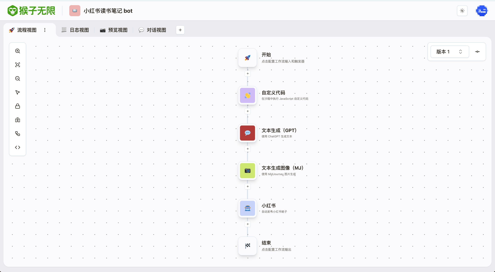
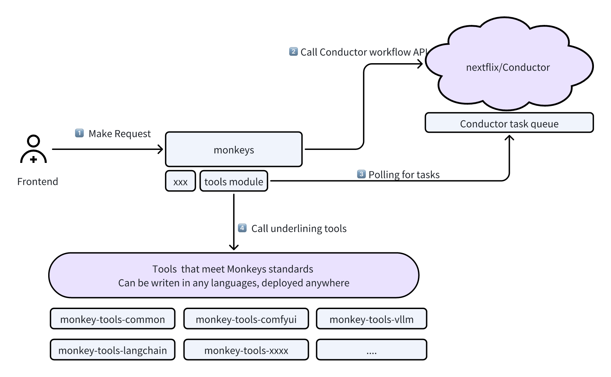

<div align="center">
<svg
          xmlns="http://www.w3.org/2000/svg"
          viewBox="0 0 173.04345703125 40.1988525390625"
          width={width}
          height={height}
        >
<path
            className="fill-vines-500 dark:fill-white"
            d="M55.891 15.985q1.486 0 1.486 1.492v16.27q0 1.491-1.486 1.491h-.877q-1.486 0-1.486-1.491v-16.27q0-1.492 1.486-1.492h.877Zm2.16-11.457q.71.136.93.627.218.492.016 1.203-2.33 7.661-5.435 14.27-.304.611-.827.747-.523.135-.962-.407l-.641-.814q-.473-.644-.608-1.22t.169-1.254q1.384-2.95 2.6-6.254 1.214-3.305 2.058-6.118.203-.712.642-.933.438-.22 1.215-.084l.844.237Zm14.145 6.474q1.35 0 1.35 1.356v.814q0 1.356-1.35 1.356H59.199q-1.35 0-1.35-1.356v-.814q0-1.356 1.35-1.356h12.997Zm-3.24-6q2.632 0 2.632 2.644v3.661q0 1.458-1.451 1.458h-.878q-1.485 0-1.485-1.492V8.46h-6.617q-1.35 0-1.35-1.356v-.746q0-1.355 1.35-1.355h7.798ZM66.49 18.63q1.485 0 1.384 1.458-.169 3.321-1.165 6.254-.996 2.932-2.616 5.084-1.62 2.153-3.578 3.271-1.182.881-1.992-.44l-.405-.746q-.405-.61-.27-1.119.135-.508.71-.983 2.497-1.864 3.915-4.762 1.418-2.899 1.62-6.526.101-1.491 1.52-1.491h.877Zm5.975 4.915q1.35 0 1.35 1.356v.813q0 1.356-1.35 1.356H59.368q-1.35 0-1.35-1.356V24.9q0-1.356 1.35-1.356h13.098ZM61.36 15.002q1.451 0 1.451 1.458v.406h8.878q1.35 0 1.35 1.356v.814q0 1.356-1.35 1.356H61.664q-1.317 0-1.992-.661t-.675-2.017v-1.22q0-1.492 1.485-1.492h.878Zm6.042 10.101q1.384-.339 1.857 1.119.574 1.763 1.553 3.068.979 1.305 2.228 2.118.641.44.793.932.152.492-.152 1.17l-.405.745q-.304.678-.793.83-.49.153-1.131-.253-2.296-1.458-3.832-3.526-1.535-2.067-1.974-4.27-.203-.712.067-1.17.27-.458.98-.627l.81-.136Zm-18.397-5.457q1.148 1.017.101 2.203l-3.375 3.763q-1.013 1.152-2.195.101l-.607-.542q-1.148-1.017-.101-2.203l3.375-3.763q1.013-1.152 2.194-.101l.608.542Zm2.33-13.152q1.18 1.05.134 2.203l-5.738 6.373q-1.013 1.118-2.16.102l-.608-.543q-1.182-1.05-.135-2.203l5.738-6.373q1.013-1.118 2.16-.101l.608.542Zm-5.874-2q1.417-.678 1.991.814 2.667 6.372 3.308 13.406.642 7.033-.405 13.406-.236 1.39-1.063 2.102-.827.711-2.245.711h-1.249q-1.62 0-1.62-1.627v-.949q0-1.627 1.62-1.627h.81q.878-6.474.203-12.338-.675-5.864-2.937-11.39-.574-1.491.776-2.101l.81-.407Zm55.765.542q1.756 0 2.583.526.827.525.557 1.491-.27.966-1.587 2.22l-9.013 8.17v14.575q0 1.458-.743 2.22-.742.763-2.227.763h-3.781q-1.587 0-1.587-1.593v-.881q0-1.593 1.587-1.593h2.565V17.036q0-1.39.98-2.271l6.244-5.661H81.107q-1.586 0-1.586-1.593V6.63q0-1.594 1.586-1.594h20.12Zm3.815 12.508q1.586 0 1.586 1.593v.882q0 1.593-1.586 1.593H77.225q-1.586 0-1.586-1.593v-.882q0-1.593 1.586-1.593h27.816Zm31.123-12.169q1.553 0 1.553 1.56v.881q0 1.56-1.553 1.56h-23.9q-1.552 0-1.552-1.56v-.881q0-1.56 1.553-1.56h23.9Zm1.52 10.508q1.552 0 1.552 1.56v.88q0 1.56-1.553 1.56h-26.937q-1.553 0-1.553-1.56v-.88q0-1.56 1.553-1.56h26.937Zm-13.03-8.61q1.586 0 1.552 1.594-.304 9.22-3.882 15.948-3.578 6.729-10.33 10.559-1.35.814-2.126-.542l-.473-.814q-.776-1.356.574-2.17 6.11-3.863 9.03-9.473 2.92-5.61 3.156-13.508.034-1.593 1.62-1.593h.878Zm2.902 10.61q1.587 0 1.587 1.593v11.322h6.785V28.73q0-1.593 1.587-1.593h.877q1.587 0 1.587 1.593v3.153q0 1.457-.726 2.186-.726.729-2.177.729h-9.08q-1.452 0-2.178-.729t-.726-2.186V19.476q0-1.593 1.587-1.593h.877Zm36.052 4.983q1.384-.508 2.025.95 1.114 2.61 2.718 4.457 1.603 1.847 3.561 2.898.71.373.895.881.185.509-.085 1.22l-.337.814q-.574 1.458-1.958.78-3.038-1.627-5.266-4.22-2.228-2.594-3.24-5.475-.608-1.424.877-1.966l.81-.339Zm6.28.475q1.045-1.051 2.092.034l.54.542q1.046 1.017 0 2.068l-1.789 1.83q-1.013 1.017-2.093-.034l-.54-.542q-1.013-1.051 0-2.068l1.79-1.83Zm-1.419-12.135q1.451 0 1.451 1.457v.814q0 1.457-1.45 1.457h-9.588q-1.45 0-1.45-1.457v-.814q0-1.457 1.45-1.457h9.587Zm.71-6.746q1.383 0 2.092.712.71.712.71 2.102v11.66q0 1.39-.71 2.102-.709.712-2.093.712h-10.296q-1.485 0-1.485-1.492v-.881q0-1.492 1.485-1.492h9.114V8.324h-8.608V31.07h1.013q1.485 0 1.485 1.492v.88q0 1.492-1.485 1.492h-2.194q-1.384 0-2.093-.711-.709-.712-.709-2.102V7.274q0-1.39.71-2.102.708-.712 2.092-.712h10.971Zm-18.87.136q1.518 0 2.311.78.793.779.76 2.304-.068 4.712-1.452 8.712 1.215 2.034 1.637 4.339.422 2.305.017 4.508-.405 2.203-1.485 4-.675 1.39-1.992.542l-.742-.474q-1.249-.814-.574-2.17.844-1.763 1.063-3.305.22-1.542-.169-2.915-.388-1.373-1.434-2.593-.878-1.085-.405-2.203 1.417-3.526 1.687-7.39h-3.139v25.016q0 1.491-1.485 1.491h-.878q-1.485 0-1.485-1.491V7.477q0-2.881 2.87-2.881h4.894ZM36.7 20.083c0 2.159.012 4.319-.005 6.478-.01 1.196-.326 2.323-.89 3.378-.735 1.377-1.822 2.39-3.168 3.16-2.893 1.656-5.77 3.34-8.654 5.01-.753.436-1.5.882-2.267 1.29-.755.403-1.57.63-2.42.739a7.38 7.38 0 0 1-1.773.014 7.645 7.645 0 0 1-3.008-1.004C12.073 37.73 9.63 36.316 7.188 34.9c-1.224-.71-2.467-1.39-3.664-2.144C1.76 31.646.66 30.036.189 28a6.294 6.294 0 0 1-.17-1.39c-.003-.385-.015-.77-.015-1.155-.001-3.89-.01-7.779.004-11.668.006-1.72.557-3.267 1.612-4.627.648-.836 1.454-1.483 2.367-2.01C7.042 5.39 10.09 3.618 13.143 1.85c.633-.366 1.262-.742 1.91-1.08a6.5 6.5 0 0 1 2.239-.686c.36-.043.723-.087 1.085-.084 1.168.01 2.29.249 3.329.796.744.392 1.467.826 2.196 1.247 2.696 1.56 5.392 3.123 8.086 4.688.618.359 1.256.69 1.818 1.14 1.425 1.14 2.337 2.603 2.73 4.39.12.549.168 1.104.167 1.666-.003 2.051-.002 4.104-.002 6.156Zm-23.805 2.144c-.039.054-.06.085-.083.115-.268.343-.545.68-.804 1.031-.234.319-.471.638-.585 1.027-.066.228-.155.45-.208.68-.095.412-.19.825-.249 1.242-.035.25.005.508-.005.763-.008.18.03.324.199.418.068.037.123.1.185.147.86.656 1.792 1.186 2.798 1.583 1.245.493 2.538.753 3.874.79.438.013.877-.017 1.315-.04a9.497 9.497 0 0 0 1.646-.255 11.544 11.544 0 0 0 4.575-2.222c.127-.1.199-.199.192-.371-.012-.297.043-.602-.002-.891a12.773 12.773 0 0 0-.325-1.42c-.085-.307-.18-.626-.347-.892-.293-.47-.642-.904-.97-1.35-.085-.115-.182-.22-.273-.33l.025-.034c.205.115.418.219.616.345.536.344 1.004.771 1.462 1.212.038.036.1.068.149.067.09-.002.178-.028.267-.048 1.626-.36 2.985-1.168 4.047-2.458 1.161-1.412 1.709-3.039 1.647-4.872-.015-.453-.07-.9-.175-1.34-.43-1.796-1.396-3.233-2.905-4.288-1.359-.95-2.876-1.358-4.53-1.277a8.525 8.525 0 0 0-2.241.391c-1.59.52-2.842 1.464-3.662 2.948-.056.102-.109.206-.172.325-.03-.056-.054-.096-.075-.138a5.948 5.948 0 0 0-.915-1.34 6.318 6.318 0 0 0-2.568-1.7 8.122 8.122 0 0 0-3.338-.477c-.435.029-.874.085-1.297.186-1.511.358-2.774 1.141-3.784 2.326-1.047 1.228-1.61 2.657-1.708 4.267-.04.659.013 1.315.16 1.962.393 1.724 1.3 3.117 2.693 4.188a6.982 6.982 0 0 0 3.04 1.336c.104.02.164-.001.237-.073.411-.408.845-.79 1.323-1.12.233-.16.475-.309.771-.413Zm-1.686 6.376.031.104c.212.64.507 1.24.886 1.796a7.219 7.219 0 0 0 1.814 1.852 7.177 7.177 0 0 0 4.143 1.332c.733.008 1.46-.02 2.177-.196a7.163 7.163 0 0 0 3.214-1.705 7.326 7.326 0 0 0 1.855-2.677c.063-.157.114-.32.17-.479-2.124 1.59-4.498 2.408-7.137 2.41-2.645 0-5.022-.817-7.153-2.437Z"
          />
<path
            className="fill-vines-500 dark:fill-white"
            d="M19.552 16.251h-2.39c.019.142.038.274.054.406.146 1.232-.16 2.345-.898 3.333-.75 1.006-1.754 1.639-2.972 1.901-1.655.357-3.156-.011-4.49-1.057-.775-.608-1.195-1.439-1.441-2.372a6.073 6.073 0 0 1-.213-1.669c.007-.359-.154-.493-.516-.544-.062-.008-.124-.01-.19-.015v-1.86c.017-.003.036-.014.054-.012.442.044.856-.102 1.281-.185a21.764 21.764 0 0 1 1.632-.272c.56-.066 1.126-.09 1.69-.125.727-.045 1.453.006 2.178.069.96.084 1.905.258 2.838.502.07.018.146.008.22.008 1.31 0 2.622-.005 3.933.005.252.002.475-.094.714-.134.633-.108 1.262-.245 1.898-.324.587-.074 1.18-.106 1.772-.122a17.98 17.98 0 0 1 1.67.03c1.073.07 2.129.25 3.171.516.173.043.361.028.542.027.106 0 .146.028.144.14a89.125 89.125 0 0 0 0 1.611c0 .104-.03.146-.135.137a.7.7 0 0 0-.19.01c-.25.05-.335.181-.36.52-.036.455-.069.91-.123 1.362-.088.728-.352 1.385-.837 1.944-.542.624-1.162 1.145-1.914 1.495-.451.211-.93.323-1.423.374-.294.03-.59.077-.885.067-1.189-.039-2.259-.42-3.178-1.188-.82-.686-1.373-1.546-1.615-2.597a4.462 4.462 0 0 1-.021-1.934c.002-.011 0-.023 0-.047Zm5.82 4.54c.25-.03.502-.051.75-.093a2.486 2.486 0 0 0 1.083-.44c.62-.46.81-1.212.745-1.94-.181 1.544-1.16 2.233-2.577 2.473Zm-14.15-.02c-1.693-.273-2.424-1.173-2.57-2.522.004.238.004.476.031.712.065.549.307 1.007.765 1.323.532.366 1.144.465 1.773.488ZM20.738 24.547c-.248-.4-.492-.397-.724-.33-.281.083-.387.29-.377.68-.208-.001-.526-.34-.58-.657a.939.939 0 0 1 .526-1.027c.353-.162.839-.058 1.072.23.275.34.311.793.083 1.104ZM17.074 24.91c.015-.386-.117-.632-.394-.703-.24-.06-.534-.005-.692.334-.148-.096-.239-.536-.08-.871.175-.373.598-.602.985-.524.447.09.76.435.772.854.013.431-.236.815-.591.91Z"
          />
</svg>

# Build Workflow-Centric AI applications

[](http://www.apache.org/licenses/LICENSE-2.0)
[](https://GitHub.com/inf-monkeys/monkeys/stargazers/)
[](https://github.com/inf-monkeys/monkeys)

</div>

## Description

Monkeys is an open source tool for build workflow-centric AI applications.



## Architecture

Monkeys Consists of the following key components:

- Monkeys Server: The main entrypoint
- [Conductor](https://github.com/inf-monkeys/conductor): A microservices orchestration engine.
- Tools: HTTP Service exposes stanard RESTFul API that meet Monkeys standards, can be writen in any languages, deployed anywhere.



## Getting Started

### Prerequisites

- [Node 18](https://nodejs.org/en/download/current): This project requires node version at least 18.
- [yarn](https://yarnpkg.com/): We use yarn as the Node Package Manager.
- [Conductor](https://github.com/inf-monkeys/conductor)(Optional): Conductor is a workflow orchestration engine, we recommand use [Docker](https://www.docker.com/products/docker-desktop/) to run Conductor, with one command bellow:

  ```bash
  docker pull swr.cn-east-3.myhuaweicloud.com/storyboard/conductor:240312

  docker run --name conductor -p 8080:8080 -d swr.cn-east-3.myhuaweicloud.com/storyboard/conductor:240312
  ```

  You can verify whether conductor running corrctly by use the following command:

  ```bash
  curl http://localhost:8080/api
  ```

  If show something like this, it's working fine:

  ```
  {"timestamp":"2024-03-21T10:29:36.635+00:00","status":404,"error":"Not Found","path":"/api"}
  ```

  > If you do not install conductor, you won't be able to use the Workflow feature, but others still works fine.

- [Redis](https://redis.io/)(Optional): We use inmemory cache as default, for test purpose, you can just skip this.
- Postgres/MySQL(Optional): We use sqlite as default storage engine, for test purpose, you can just skip this.

### Installation

1. Clone the repo
   ```sh
   git clone https://github.com/inf-monkeys/monkeys.git
   ```
2. Install NPM packages
   ```sh
   yarn
   ```
3. Run the server:

   ```sh
   yarn start
   ```

That's all, you are ready to go!

### OpenAPI Documentation

After you start the project, you can visit the following OpenAPI documentations:

- [http://localhost:3000/openapi/server/](http://localhost:3000/openapi/server/)
- [http://localhost:3000/openapi/tools/](http://localhost:3000/openapi/tools/)

## Write Your Own Monkey Tool

We provided detailed information on how to write your own monkey tool, it's as simple as writing standard RESTFul APIs. You can read more on this topic at [Write your own tools](#TODO)

## Contributing

Contributions are what make the open source community such an amazing place to learn, inspire, and create. Any contributions you make are **greatly appreciated**.

If you have a suggestion that would make this better, please fork the repo and create a pull request. You can also simply open an issue with the tag "enhancement".

### Contributors

<a href="https://github.com/inf-monkeys/monkeys/graphs/contributors">
  
</a>

### How to Contribute

1. Fork the Project
2. Create your Feature Branch (`git checkout -b feat/AmazingFeature`)
3. Commit your Changes (`git commit -m 'Add some AmazingFeature'`)
4. Push to the Branch (`git push origin feature/AmazingFeature`)
5. Open a Pull Request
