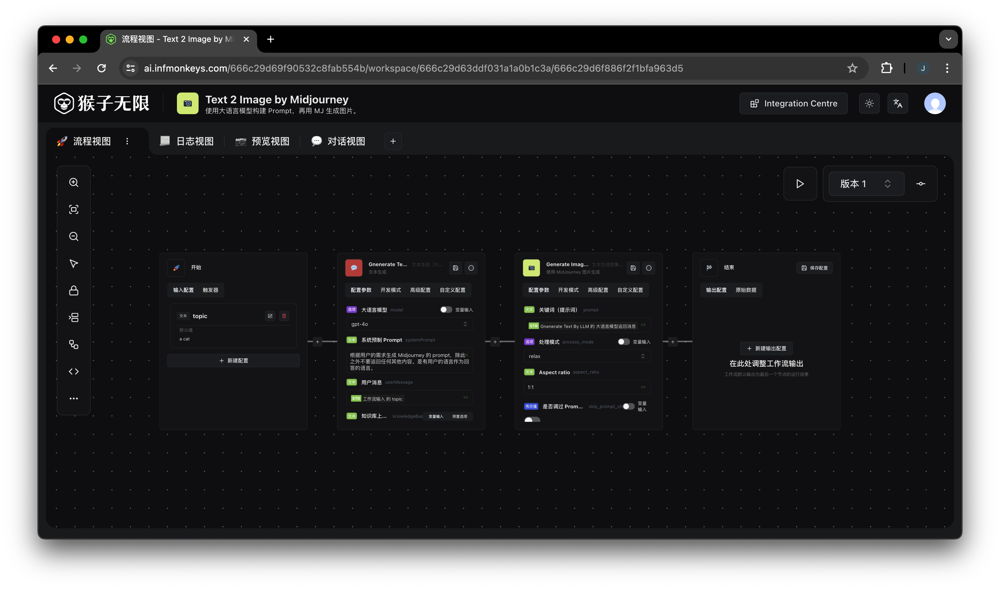
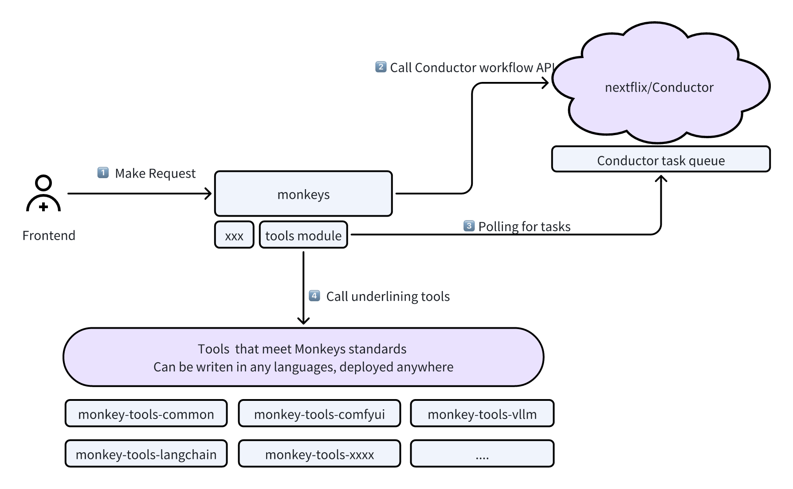

<div align="center">

# Monkeys - Build Workflow-Centric AI applications

[](http://www.apache.org/licenses/LICENSE-2.0)
[](https://GitHub.com/inf-monkeys/monkeys/stargazers/)
[](https://github.com/inf-monkeys/monkeys)

Monkeys is an open source tool for build workflow-centric AI applications.




</div>

> **Note: We are currently iterating rapidly, so backwards compatibility is not guaranteed until a stable version (1.0.0) is released.**

<details>
<summary><kbd>Table of contents</kbd></summary>

#### TOC

- [📚 Documentation](#-documentation)
- [🏃‍♂️ Get Started](#️-get-started)
  - [👨‍💻 Developer](#-developer)
  - [🐳 Docker](#-docker)
- [📦 Ecosystem](#-ecosystem)
- [🤝 Contributing](#-contributing)

####
<br/>

</details>

## 📚 Documentation

<details>
<summary><kbd>Show brief Architecture</kbd></summary>

Monkeys Consists of the following key components:

- Monkeys Server: The main entrypoint
- [Conductor](https://github.com/inf-monkeys/conductor): A microservices orchestration engine.
- Tools: HTTP Service exposes standard RESTFul API that meet Monkeys standards, can be writen in any languages, deployed anywhere.



</details>

You can read the documentation here: [https://inf-monkeys.github.io/docs/](https://inf-monkeys.github.io/docs/).

## 🏃‍♂️ Get Started

### 👨‍💻 Developer

<details>
<summary><kbd>Prerequisites</kbd></summary>

- [Node 18](https://nodejs.org/en/download/current): This project requires node version at least 18.
- [yarn](https://yarnpkg.com/): We use yarn as the Node Package Manager.
- [Conductor](https://github.com/inf-monkeys/conductor)(Optional): Conductor is a workflow orchestration engine, we recommand use [Docker](https://www.docker.com/products/docker-desktop/) to run Conductor, with one command bellow:

  ```bash
  docker pull infmonkeys/conductor:1.0.0

  docker run -d --name conductor -p 8080:8080 -d infmonkeys/conductor:1.0.0
  ```

  You can verify whether conductor running corrctly by use the following command:

  ```bash
  curl http://localhost:8080/api
  ```

  If show something like this, it's working fine:

  ```
  {"timestamp":"2024-03-21T10:29:36.635+00:00","status":404,"error":"Not Found","path":"/api"}
  ```

  > If you do not install conductor, you won't be able to use the Workflow feature, but others still works fine.

- [Redis](https://redis.io/)(Optional): We use inmemory cache as default, for test purpose, you can just skip this.
- Postgres/MySQL(Optional): We use sqlite as default storage engine, for test purpose, you can just skip this.

<br/>

</details>

#### Backend

1. Clone the repo
   ```sh
   git clone https://github.com/inf-monkeys/monkeys.git
   ```
2. Go to `monkeys` folder

   ```sh
   cd monkeys
   ```

3. Install Node Modules
   ```sh
   yarn
   ```
4. Run the server:

   ```sh
   yarn start
   ```

#### Frontend 

1. Go to `ui` folder

   ```sh
   cd ui
   ```

2. Install Node Modules

   ```sh
   yarn
   ```

3. Update `.env`

   ```sh
   cp .env.example .env
   ```

   Set `SERVER_ENDPOINT` to your local server, `http://localhost:3000` for example.

4. Start UI

   ```sh
   yarn dev
   ```

That's all, you are ready to go!


### 🐳 Docker

#### Docker Compose

We provide a docker-compose yaml, check the [docs](./docker/README.md).

#### Helm

We provide a helm chart, check the [docs](https://inf-monkeys.github.io/docs/zh-cn/getting-started/helm/).


## 📦 Ecosystem

Here is a detailed list of existing awesome monkey tools: [https://github.com/inf-monkeys/awesome-monkey-tools](https://github.com/inf-monkeys/awesome-monkey-tools).

We provided detailed information on how to write your own monkey tool, it's as simple as writing standard RESTFul APIs. You can read more on this topic at [Write your own tools](https://inf-monkeys.github.io/docs/zh-cn/build-tools/introduction/)

## 🤝 Contributing

Contributions of all types are more than welcome; if you are interested in contributing code, feel free to check out our GitHub [Issues][https://github.com/inf-monkeys/monkeys/issues].

<a href="https://github.com/inf-monkeys/monkeys/graphs/contributors">
  
</a>

