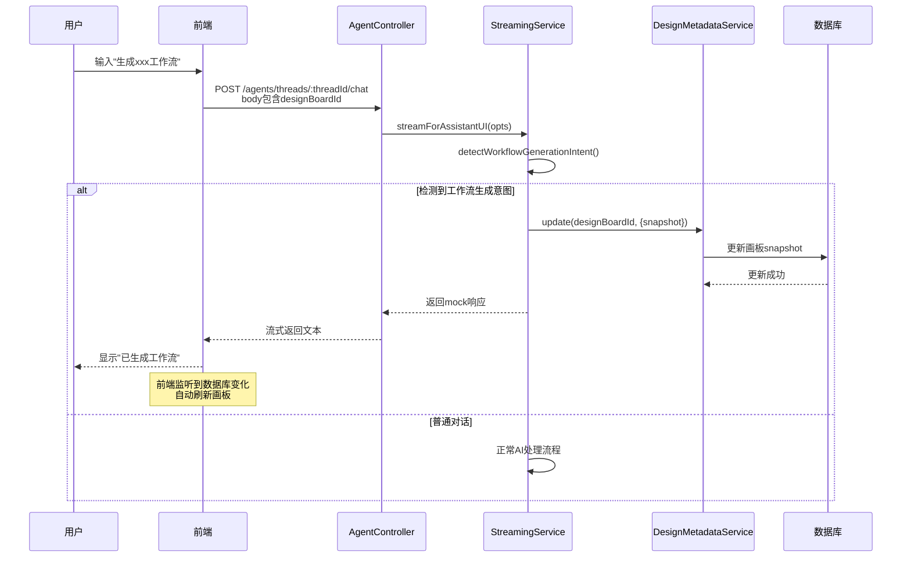

# 画板Agent工作流生成功能实现说明

## 功能概述

当用户在画板的agent中输入类似"生成xxx工作流"的请求时，后端会自动检测意图并直接更新数据库中的画板snapshot，无需AI模型参与，也不需要通过工具调用前端处理。

## 后端实现（已完成）

### 1. 数据库直接更新方式

后端通过 `DesignMetadataService` 直接更新画板数据库中的 `snapshot` 字段，实现即时更新。

### 2. 核心修改文件

#### [agent-tool-registry.service.ts](src/modules/agent/services/agent-tool-registry.service.ts#L454-L475)
- 注册了 `tldraw_load_canvas_state` 工具（用于未来扩展，当前不走工具流程）

#### [streaming.service.ts](src/modules/agent/services/streaming.service.ts)
- **行400-414**: 添加 `detectWorkflowGenerationIntent()` 方法，检测工作流生成意图
- **行417-507**: 添加 `createWorkflowGenerationMockResponse()` 方法，直接更新数据库中的画板数据
- **行547-551**: 在主流式处理方法中集成意图检测逻辑

#### [agent.controller.ts](src/modules/agent/agent.controller.ts)
- **行195**: 添加 `designBoardId` 参数到请求body
- **行231**: 将 `designBoardId` 传递给StreamingService

#### [agent.module.ts](src/modules/agent/agent.module.ts)
- **行34**: 导入 `DesignModule`，以便使用 `DesignMetadataService`

### 3. 工作流程



### 4. 意图检测规则

支持以下中英文模式：
- 生成.*工作流
- 创建.*工作流
- 制作.*工作流
- 帮我.*工作流
- generate.*workflow
- create.*workflow
- make.*workflow

### 5. Mock画板数据

预定义的工作流数据包含：
- 2个instruction节点（图片上传、文本输入）
- 1个workflow节点（视觉概念探索图像生成工作流）
- 1个output节点
- 连接线和绑定关系

## 前端需要实现的部分

### 1. 传递 `designBoardId` 参数

在调用 `/agents/threads/:threadId/chat` API时，需要在body中添加 `designBoardId` 字段：

```typescript
// 在 AgentRuntimeProvider 或相关组件中
const response = await fetch(`/api/agents/threads/${threadId}/chat`, {
  method: 'POST',
  headers: {
    'Content-Type': 'application/json',
  },
  body: JSON.stringify({
    teamId,
    userId,
    agentId: 'tldraw-assistant',
    messages: [...],
    canvasData: currentCanvasSnapshot,
    selectedShapeIds,
    viewport,
    // 新增：传递画板ID
    designBoardId: currentDesignBoardId, // 当前画板的ID
  }),
});
```

### 2. 监听画板数据变化

当后端更新数据库后，前端需要监听并刷新画板：

#### 方案A：轮询（简单实现）

```typescript
// 在画板组件中
useEffect(() => {
  if (!designBoardId) return;

  const interval = setInterval(async () => {
    // 获取最新的画板数据
    const latestMetadata = await fetchDesignBoardMetadata(designBoardId);

    // 检查snapshot是否更新
    if (latestMetadata.updatedTimestamp > lastUpdateTimestamp) {
      // 加载新的snapshot
      editor.loadSnapshot(latestMetadata.snapshot);
      setLastUpdateTimestamp(latestMetadata.updatedTimestamp);
    }
  }, 2000); // 每2秒检查一次

  return () => clearInterval(interval);
}, [designBoardId, editor]);
```

#### 方案B：WebSocket实时更新（推荐）

```typescript
// 建立WebSocket连接
const ws = new WebSocket(`ws://your-server/design-board/${designBoardId}`);

ws.onmessage = (event) => {
  const data = JSON.parse(event.data);

  if (data.type === 'snapshot_updated') {
    // 加载新的snapshot
    editor.loadSnapshot(data.snapshot);
    toast.success('画板已更新！');
  }
};
```

### 3. 获取当前画板ID

确保在agent对话组件中能够访问当前画板ID：

```typescript
// 在 vines-design-board-lazy.tsx 中
const { designBoardId } = useDesignBoardStore();

// 传递给 AgentRuntimeProvider
<AgentRuntimeProvider
  designBoardId={designBoardId}
  // ... 其他props
>
  {/* Agent UI */}
</AgentRuntimeProvider>
```

## 测试方法

### 后端测试

1. 启动后端服务：
```bash
yarn start:dev
```

2. 使用curl测试API：
```bash
curl -X POST http://localhost:3000/agents/threads/{threadId}/chat \
  -H "Content-Type: application/json" \
  -d '{
    "teamId": "your-team-id",
    "userId": "your-user-id",
    "agentId": "tldraw-assistant",
    "messages": [
      {"role": "user", "content": "帮我生成一个图像生成工作流"}
    ],
    "designBoardId": "your-board-id"
  }'
```

3. 检查数据库中画板的snapshot是否更新

### 前端测试

1. 打开画板，确保有agent对话界面
2. 在agent输入框中输入："生成一个图像生成工作流"
3. 应该看到：
   - Agent回复："好的，我已经为您生成了一个图像生成工作流..."
   - 画板自动刷新，显示新的工作流节点

## 扩展说明

### 添加更多工作流模板

在 `streaming.service.ts` 中修改 `MOCK_WORKFLOW_CANVAS_STATE` 常量：

```typescript
// 可以根据用户输入的关键词选择不同的模板
private getWorkflowTemplate(userMessage: string): any {
  if (userMessage.includes('图像生成')) {
    return IMAGE_GENERATION_TEMPLATE;
  } else if (userMessage.includes('文本处理')) {
    return TEXT_PROCESSING_TEMPLATE;
  }
  // 默认模板
  return DEFAULT_TEMPLATE;
}
```

### 支持AI生成工作流

如果需要真正的AI生成工作流（而非预定义模板），可以：

1. 移除mock响应逻辑
2. 使用 `list_workflows` 和 `tldraw_create_workflow` 工具
3. 让AI模型根据用户需求选择合适的工作流

## 注意事项

1. **权限检查**: 确保用户有权限修改该画板
2. **并发控制**: 如果多人同时编辑画板，需要考虑冲突处理
3. **历史记录**: 考虑保存画板修改历史，支持撤销操作
4. **性能优化**: 对于大型画板，更新snapshot可能较慢，需要优化

## 相关文件

- 后端核心逻辑：[streaming.service.ts](src/modules/agent/services/streaming.service.ts)
- API端点：[agent.controller.ts](src/modules/agent/agent.controller.ts)
- 工具注册：[agent-tool-registry.service.ts](src/modules/agent/services/agent-tool-registry.service.ts)
- 模块配置：[agent.module.ts](src/modules/agent/agent.module.ts)
