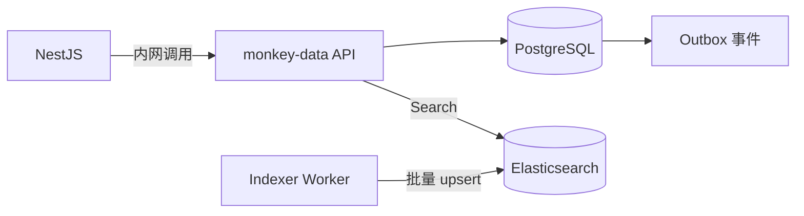

# monkey-data

## 简介
monkey-data 是数据管理 V2 的 Go 子模块，负责资源/标签/视图的 CRUD 与检索加速。
它不处理上传与权限校验，权限由主后端（NestJS）负责。

## 架构与数据流


说明：
- PostgreSQL 为权威数据源；ES 仅用于检索加速。
- 写入走 PG + Outbox，Worker 异步入 ES，最终一致。

## 目录结构
- `cmd/asset-api`：HTTP API 入口（Gin）。
- `cmd/asset-indexer`：Outbox Worker 入口。
- `internal/httpapi`：路由与 handler（保持 `{ code, data }` 响应结构）。
- `internal/service`：业务编排层。
- `internal/repo`：PG 存取与 Outbox。
- `internal/search`：ES 搜索与分页 token。
- `internal/indexer`：ES bulk 写入。
- `internal/reindex`：重建索引任务（供 HTTP 触发）。
- `internal/model`：数据模型。
- `internal/config`：配置读取（env 优先于 config.yaml）。
- `docs/`：协议与数据库结构文档。

## 启动方式

### 1) 准备配置
编辑 `monkey-data/config.yaml`，或使用环境变量覆盖。

最小示例：
```yaml
database:
  host: "127.0.0.1"
  port: 5432
  username: "root"
  password: "pass"
  database: "monkeys"
  sslmode: "disable"
elasticsearch:
  url: "http://127.0.0.1:9200"
internal_token: "monkey-data-internal-token"
```

常用环境变量（env 优先）：
- `MONKEY_DATA_HTTP_ADDR`：HTTP 监听地址（默认 `:8081`）
- `MONKEY_DATA_PG_DSN`：Postgres DSN
- `MONKEY_DATA_ES_URL` / `MONKEY_DATA_ES_USER` / `MONKEY_DATA_ES_PASS`
- `MONKEY_DATA_INTERNAL_TOKEN`
- `MONKEY_DATA_APP_ID_HEADER`（默认 `X-App-Id`）
- `MONKEY_DATA_TEAM_ID_HEADER`（默认 `X-Team-Id`）
- `MONKEY_DATA_PAGE_TOKEN_SECRET`
- `MONKEY_DATA_WORKER_APP_ID` / `MONKEY_DATA_WORKER_*`（indexer 使用）

### 2) 启动 API
```bash
cd monkey-data
go run .\cmd\asset-api\
```

### 3) 启动 Indexer
```bash
cd monkey-data
go run .\cmd\asset-indexer\
```

### 4) 健康检查
```bash
curl -H "X-Internal-Token: monkey-data-internal-token" http://127.0.0.1:8081/healthz
curl -H "X-Internal-Token: monkey-data-internal-token" http://127.0.0.1:8081/readyz
```

## 内部索引重建（HTTP）
- `GET /v2/index/app-ids`：扫描可用 app_id。
- `POST /v2/index/rebuild`：异步重建索引（全局并发上限 2，同一 app_id 互斥）。
- `GET /v2/index/jobs/{id}`：查询任务进度。

说明：需要配置 ES，否则重建会失败。

## 请求与响应
- 统一响应：`{ "code": "OK", "data": ... }`
- 失败响应：`{ "code": "INVALID_ARGUMENT", "data": { "message": "..." } }`
- 除 `/healthz`、`/readyz` 与 `/v2/index/*` 外，必须携带：
  - `X-App-Id`：租户标识（表前缀/索引前缀）
  - `X-Team-Id`：团队标识（强制过滤）

## 相关文档
- `docs/http-api.md`：HTTP 接口与分页规则
- `docs/database-schema.md`：PG 表与 ES 索引结构
- `docs/migration-template-v2.ts`：V2 表迁移模板
